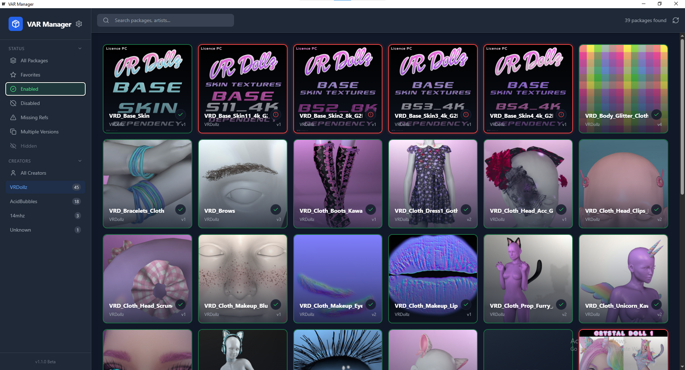

# YAVAM (Yet Another VaM Addon Manager)

**YAVAM** is a desktop tool designed to manage `.var` files (Virt-A-Mate archives). It provides a modern, grid-based dashboard to browse, filter, and organize your package collection.

This tool was developed with the assistance of an AI agent.

## Features

*   **Package Browser**: View your `.var` files in a responsive grid with thumbnails.
*   **Web Server & Mobile Support**: Access your library from any device on your network via a browser. Includes a fully responsive mobile interface.
*   **Remote Management**: Enable/Disable packages, view details, and manage files from your phone or tablet.
*   **Drag & Drop Upload**: Wireless file transfer - upload `.var` files directly from your browser to the host library.
*   **Duplicate Detection**: Automatically identifies duplicate packages (multiple versions of the same file).
*   **Missing Dependencies**: Scans packages to find missing references and allows you to view which dependencies are missing.
*   **Search & Filter**: Powerful filtering by Status (Enabled/Disabled/Missing Refs), Creator, Tags, and Types.
*   **Pagination**: optimized performance for large libraries with configurable page size.

## What this tool is NOT

*   **Not a VR VR-Overlay**: This is a standard 2D desktop application. VR support is not planned as the developers do not own VR hardware.
*   **Not a Game Mod**: This runs outside of Virt-A-Mate. It does not inject code into the game.

## Prerequisites

To build or contribute to this project, you need the following installed:

1.  **Go (Golang)**: Version 1.21 or higher. [Download Go](https://go.dev/dl/)
2.  **Node.js & npm**: Recent stable version. [Download Node.js](https://nodejs.org/)
3.  **Wails**: The framework used for the GUI.
    ```bash
    go install github.com/wailsapp/wails/v2/cmd/wails@latest
    ```

### Troubleshooting Build Issues
If you encounter errors like `method already declared` or dependency issues during `wails dev`:
*   Ensure you are in the project root.
*   Try manually installing frontend dependencies:
    ```bash
    cd frontend
    npm install
    cd ..
    ```
*   Clean the build cache: `wails clean`.

## How to Build & Run

We have included batch scripts for convenience:

*   **Run in Development Mode** (Hot Reload):
    Double-click `dev.bat` or run:
    ```bash
    wails dev
    ```

*   **Build for Production** (Creates `.exe`):
    Double-click `build.bat` or run:
    ```bash
    wails build
    ```
    The output binary will be in `build/bin/`.

## Screenshots


*The main dashboard view showing the responsive grid and sidebar.*


*Right-click context menu for quick actions like Favorites and Hiding.*

## Important Notes

*   **AI Development**: This software was written with the assistance of an AI coding agent.
*   **VR Support**: VR support is **not considered** and will not be added until the developers can afford a VR device to test it. This will remain a desktop-only tool.
*   **Simplicity**: The tool is designed for personal use and aims to stay simple and efficient.
*   **External Repositories**: This tool can function as a standalone `.var` browser for any folder, making it useful for organizing downloads before moving them to your game folder.

## Author
FivelSystems

## Dependencies & Acknowledgements
*   **Wails**: Frontend/Backend bridge.
*   **energye/systray**: Cross-platform system tray support (pure Go/minimal dependencies).

## System Tray & Resource Usage
When the "Run in Background" option is enabled (available in Network Settings), closing the main window will minimize the application to the system tray.
*   **Resource Usage**: Minimizing/Hiding the window effectively suspends the frontend rendering process (WebView2), drastically reducing GPU and CPU usage on the host machine while keeping the HTTP server active for remote clients.
*   **Restoration**: You can restore the window by right-clicking the tray icon and selecting "Show Window", or via the Web Interface if configured.
