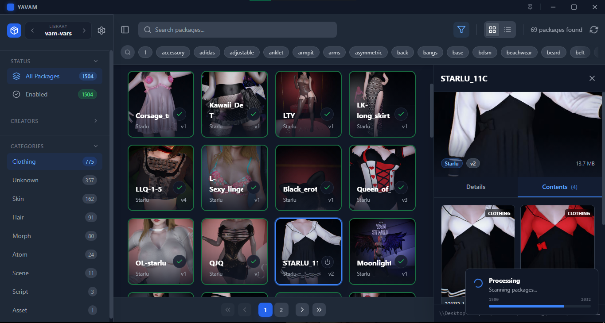
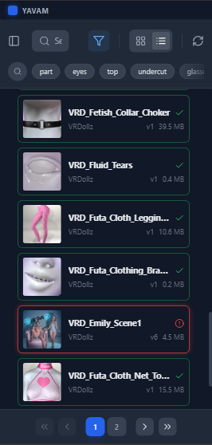
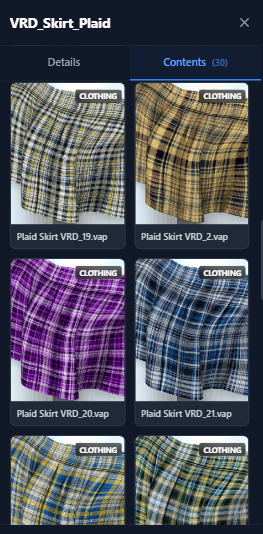

# YAVAM (Yet Another VaM Addon Manager) ~ ✨

> **Your .var library, but faster, smarter, and available everywhere.** 💖  
> *Manage your collection from your PC, or stay cozy in bed and use your phone.* 🛌💤



Hi! This is **YAVAM**. It's a standalone tool designed to be the "Brain" for your massive Virt-A-Mate content collection. 🧠

It indexes everything (and I mean *everything*, thousands of files in seconds), figures out what's inside them, and gives you a beautiful grid to browse. Best of all? It runs a local server so you can access it from any device on your Wi-Fi.

It doesn't touch your game files, it doesn't make a mess, and it just works. Even with NAS drives! 📂✨

---

## 💖 Why you'll love it

### **Remote Access (The Best Part!)** 📱
Why sit at your desk to organize files?
- **Control from Anywhere**: Enable the web server in settings, and boom! Your entire library is on your phone/tablet.
- **Lazy Mode**: Toggling a package on your phone instantly updates it on your PC. It’s magic.
- **Wireless Drop**: Drag & drop `.var` files into your browser on your desktop to wirelessly upload them to your main library. No cables, no hassle.

### **It's actually smart** 🧠
- **No more guessing**: YAVAM looks *inside* the zip files to tell you if a package is a "Look", "Scene", "Clothing", or "Script" automatically.
- **Dependencies? Solved**: Instantly spot packages that are missing files so you can fix them.
- **Dupes be gone**: It finds duplicate packages (same file, different versions) and lets you resolve them with one click.

### **Respects your space** 🧹
- **Non-Destructive**: It reads your files exactly where they are. No moving, no copying, no weird `_data` folders cluttering your drive.
- **Game Independent**: You don't even need Virt-A-Mate installed! It works perfectly as a pure `.var` browser for backups or external drives.
- **Clean & Fast**: It’s built to fly through hundreds of packages without stuttering.

---

## 🛠️ How to use it

### **Installation**
1.  Grab the latest `YAVAM.exe` from [Releases](https://github.com/fivelsystems/yavam/releases).
2.  Run it! (It's portable).
3.  **First Launch**: Just point it to any folder where you keep your `.var` files.
4.  **Go Remote**: Head to `Settings` -> `Network`, check "Run Web Server", and visit the address shown on your phone!

### **Web Client**
Once you turn on the server, just type your PC's IP into any browser:
`http://<YOUR-PC-IP>:8080` (e.g., `http://192.168.1.15:8080`)

---

## 📸 See it in action

| **Your Library** | **On your Phone** |
|:---:|:---:|
|  |  |
| *Browsing is super snappy.* | *Full control, tiny package.* |

---

## 🔮 Roadmap (The fun stuff coming soon!)
- **v1.3.0**: **Security** (Network passwords, so your roommates can't mess with your library 🔒).
- **v1.4.0**: **Granular Control** (Hide specific "private" libraries from the web view 🤫).
- **v1.5.0**: **Bulk Downloads** (Grab tons of files as one big ZIP).
- **v1.8.0**: **Hub Integration** (Find missing dependencies online automatically!).

---

## 👩‍💻 For the Devs

This is built with **Wails** (Go + React + TypeScript). We keep the codebase clean and modular!

### Prerequisites
- **Go**: v1.21 or higher
- **Node.js**: v20+
- **Wails CLI**: `go install github.com/wailsapp/wails/v2/cmd/wails@latest`

### Build It
Clone the repo and run:

```bash
# Power up Dev Mode (Hot Reload)
wails dev

# Compile for Release
wails build
```

You'll find your fresh `YAVAM.exe` in the `build/bin/` folder. Happy coding! 💜

---

*Made with love by [FivelSystems](https://github.com/fivelsystems)*
